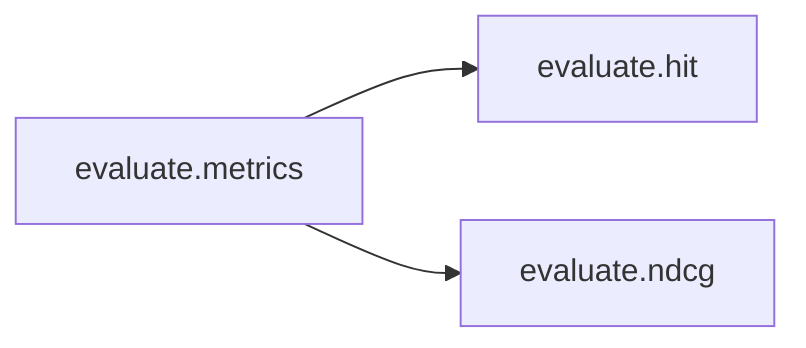

# Key Objects

[_Documentation generated by Documatic_](https://www.documatic.com)

<!---Documatic-section-evaluate.metrics-start--->
## evaluate.metrics

<!---Documatic-section-metrics-start--->


### Object Calls

* evaluate.hit
* evaluate.ndcg

<!---Documatic-block-evaluate.metrics-start--->
<details>
	<summary><code>evaluate.metrics</code> code snippet</summary>

```python
def metrics(model, test_loader, top_k):
    (HR, NDCG) = ([], [])
    for (user, item, label) in test_loader:
        user = user.cuda()
        item = item.cuda()
        predictions = model(user, item)
        (_, indices) = torch.topk(predictions, top_k)
        recommends = torch.take(item, indices).cpu().numpy().tolist()
        gt_item = item[0].item()
        HR.append(hit(gt_item, recommends))
        NDCG.append(ndcg(gt_item, recommends))
    return (np.mean(HR), np.mean(NDCG))
```
</details>
<!---Documatic-block-evaluate.metrics-end--->
<!---Documatic-section-metrics-end--->

# #
<!---Documatic-section-evaluate.metrics-end--->

<!---Documatic-section-evaluate.ndcg-start--->
## evaluate.ndcg

<!---Documatic-section-ndcg-start--->
<!---Documatic-block-evaluate.ndcg-start--->
<details>
	<summary><code>evaluate.ndcg</code> code snippet</summary>

```python
def ndcg(gt_item, pred_items):
    if gt_item in pred_items:
        index = pred_items.index(gt_item)
        return np.reciprocal(np.log2(index + 2))
    return 0
```
</details>
<!---Documatic-block-evaluate.ndcg-end--->
<!---Documatic-section-ndcg-end--->

# #
<!---Documatic-section-evaluate.ndcg-end--->

<!---Documatic-section-evaluate.hit-start--->
## evaluate.hit

<!---Documatic-section-hit-start--->
<!---Documatic-block-evaluate.hit-start--->
<details>
	<summary><code>evaluate.hit</code> code snippet</summary>

```python
def hit(gt_item, pred_items):
    if gt_item in pred_items:
        return 1
    return 0
```
</details>
<!---Documatic-block-evaluate.hit-end--->
<!---Documatic-section-hit-end--->

# #
<!---Documatic-section-evaluate.hit-end--->

<!---Documatic-section-data_utils.load_all-start--->
## data_utils.load_all

<!---Documatic-section-load_all-start--->
<!---Documatic-block-data_utils.load_all-start--->
<details>
	<summary><code>data_utils.load_all</code> code snippet</summary>

```python
def load_all(test_num=100):
    train_data = pd.read_csv(config.train_rating, sep='\t', header=None, names=['user', 'item'], usecols=[0, 1], dtype={0: np.int32, 1: np.int32})
    user_num = train_data['user'].max() + 1
    item_num = train_data['item'].max() + 1
    train_data = train_data.values.tolist()
    train_mat = sp.dok_matrix((user_num, item_num), dtype=np.float32)
    for x in train_data:
        train_mat[x[0], x[1]] = 1.0
    test_data = []
    with open(config.test_negative, 'r') as fd:
        line = fd.readline()
        while line != None and line != '':
            arr = line.split('\t')
            u = eval(arr[0])[0]
            test_data.append([u, eval(arr[0])[1]])
            for i in arr[1:]:
                test_data.append([u, int(i)])
            line = fd.readline()
    return (train_data, test_data, user_num, item_num, train_mat)
```
</details>
<!---Documatic-block-data_utils.load_all-end--->
<!---Documatic-section-load_all-end--->

# #
<!---Documatic-section-data_utils.load_all-end--->

[_Documentation generated by Documatic_](https://www.documatic.com)